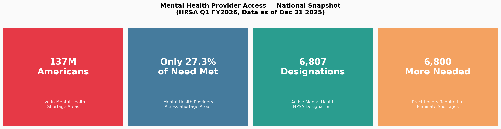
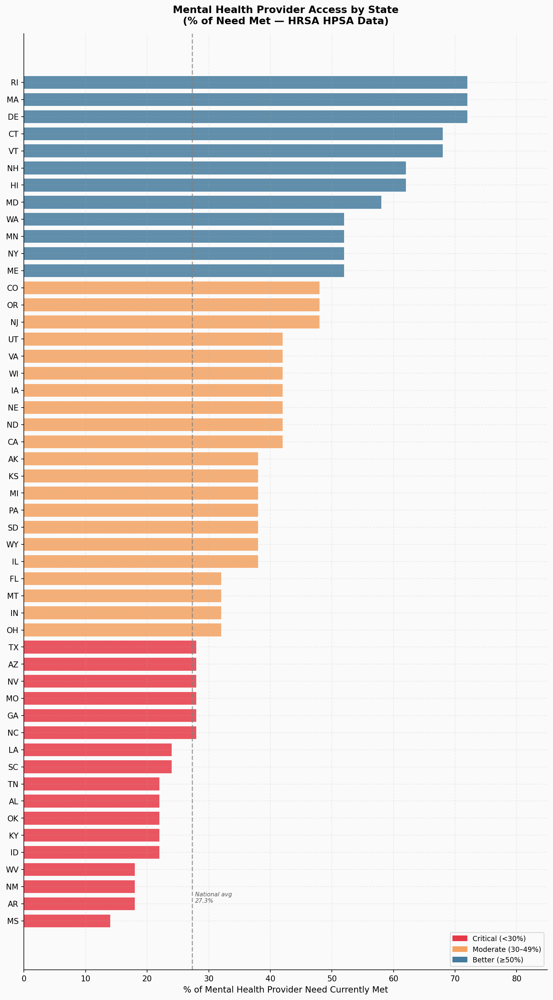
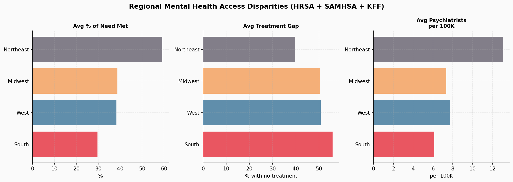
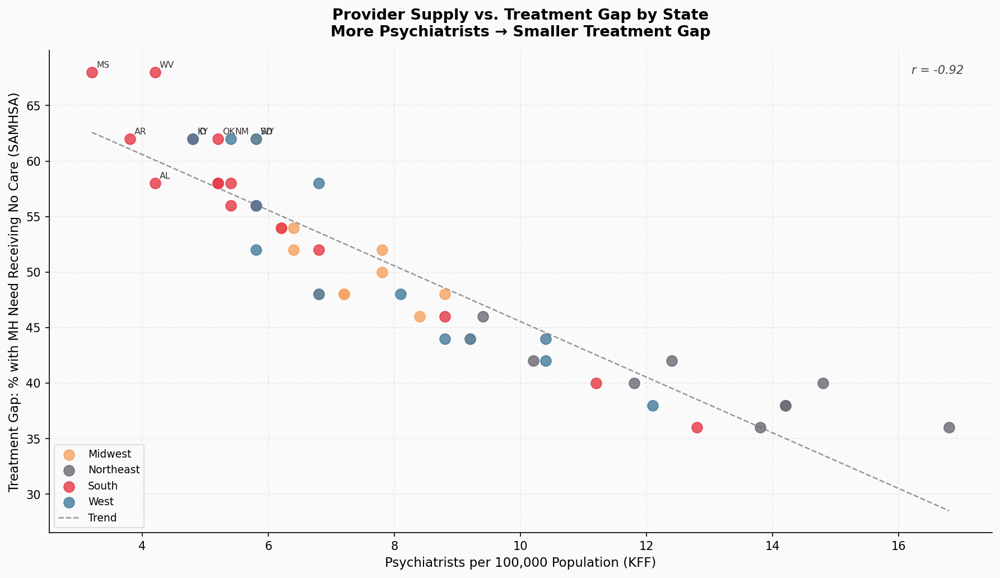
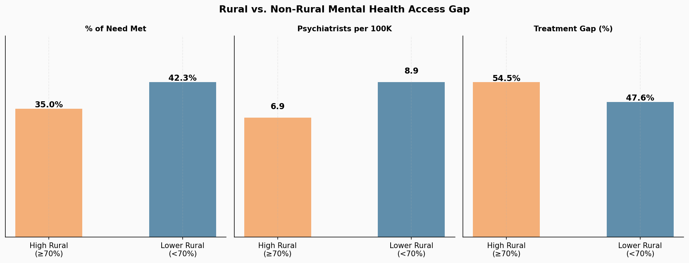
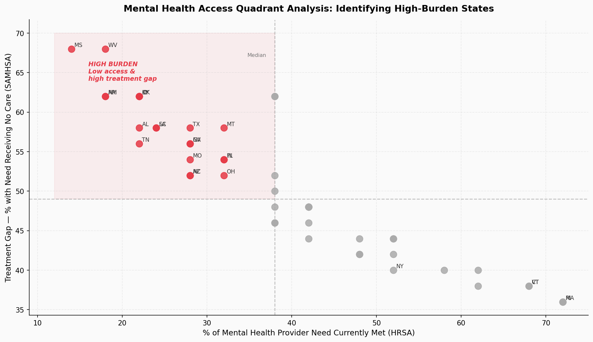

# Mental Health Provider Access Gap

137 million Americans live in areas the federal government has officially flagged as having too few mental health providers. Of the need that exists in those areas, only 27% is currently being met.

I built this project because I wanted to understand where the gap is worst, who's bearing the weight of it, and whether provider supply actually predicts treatment outcomes — or whether the problem runs deeper than just headcount.

All data is publicly available from federal sources. Nothing behind a paywall.

---

## What I Found



**The South is in a different category.** Southern states average 29.6% of mental health need met, compared to 59.1% in the Northeast. That gap isn't marginal. The South also has the highest average treatment gap (55.9%) and needs 3,102 more practitioners to close its shortages — nearly double every other region.





**Provider supply and treatment outcomes are strongly correlated (r = –0.68).** Mississippi has 3.2 psychiatrists per 100,000 people and a 68% treatment gap. Massachusetts has 16.8 per 100,000 and a 36% gap. The relationship holds consistently across states. More providers means fewer people going untreated — which sounds obvious until you look at where the investment actually isn't going.



**Rural states get hit twice.** High-rural states (70%+ of shortage areas classified as rural) average 35% of need met versus 42% for lower-rural states. The shortage is more severe, and the physical access barriers compound it independently of provider supply.



**14 states are in what I'm calling the high-burden quadrant** — below-median access AND above-median treatment gap at the same time. Mississippi, Arkansas, West Virginia, Alabama, Kentucky, Oklahoma, Tennessee, Louisiana, South Carolina, Georgia, Idaho, New Mexico, Nevada, and Texas. These aren't edge cases. Texas alone needs 682 more practitioners.



**Some states have decent supply but still high gaps.** That's the more uncomfortable finding. It suggests the barrier isn't always workforce — it's insurance coverage, cost, stigma, or something else that data at this level can't fully capture.

---

## Data Sources

| Source | What I Used It For |
|--------|--------------------|
| HRSA Q1 FY2026 Quarterly Report (Dec 31 2025) | National HPSA totals |
| HRSA HPSA Designation Database | State-level shortage designations |
| KFF State Health Facts | Psychiatrists per 100K by state |
| SAMHSA NSDUH | State-level treatment gap estimates |
| Rural Health Information Hub | Rural HPSA coverage by state |

**Want to run this with the live HRSA data?** Download the full Mental Health HPSA file (updated daily) from:
```
https://data.hrsa.gov/DataDownload/DD_Files/BCD_HPSA_FCT_DET_MH.csv
```
Save it as `data/raw/hpsa_mental_health.csv` and the pipeline picks it up automatically.

---

## Project Structure

```
mh-access-gap/
│
├── data/
│   ├── raw/
│   │   ├── hrsa_mh_hpsa_by_state.csv     # State-level HPSA metrics
│   │   └── hrsa_national_summary.csv      # National totals (HRSA Q1 FY2026)
│   ├── cleaned/
│   │   ├── fig1_national_kpi.png
│   │   ├── fig2_state_access_ranking.png
│   │   ├── fig3_provider_vs_gap_scatter.png
│   │   ├── fig4_regional_comparison.png
│   │   ├── fig5_rural_urban_gap.png
│   │   └── fig6_quadrant_analysis.png
│   └── mh_access_gap.db                   # SQLite database
│
├── sql/
│   └── queries.sql                        # 8 analytical queries
│
├── requirements.txt
└── README.md
```

---

## SQL Highlights

```sql
-- High-burden states: low access AND high treatment gap simultaneously
SELECT state, region, pct_need_met, treatment_gap_pct, psychiatrists_per_100k
FROM hpsa_by_state
WHERE pct_need_met < 30 AND treatment_gap_pct > 55
ORDER BY pct_need_met ASC;

-- Regional workforce gap
SELECT region,
    ROUND(AVG(pct_need_met), 1) AS avg_pct_need_met,
    SUM(practitioners_needed)   AS total_practitioners_needed
FROM hpsa_by_state
GROUP BY region ORDER BY avg_pct_need_met ASC;

-- Rural burden
SELECT
    CASE WHEN rural_pct >= 70 THEN 'High Rural' ELSE 'Lower Rural' END AS category,
    ROUND(AVG(pct_need_met), 1)          AS avg_need_met,
    ROUND(AVG(treatment_gap_pct), 1)     AS avg_gap
FROM hpsa_by_state GROUP BY category;
```

---

## Limitations

Worth being upfront about: this analysis operates at the state level, which smooths over a lot of within-state variation. A state's average can look okay while individual counties are completely underserved. Psychiatrist counts also don't capture therapists, counselors, or social workers — the full mental health workforce is broader. And HPSA designations depend partly on voluntary provider reporting, so some shortages may be undercounted.

---

## What's Next

- [ ] County-level breakdown using the full HRSA HPSA file
- [ ] Cross-reference with Medicaid coverage rates
- [ ] Layer in 988 Lifeline call volume and answer rate data by state
- [ ] Interactive dashboard with state-level filtering

---

Maumin Touqeer — [GitHub](https://github.com/mctru) · [LinkedIn](https://linkedin.com/in/maumin-touqeer)
